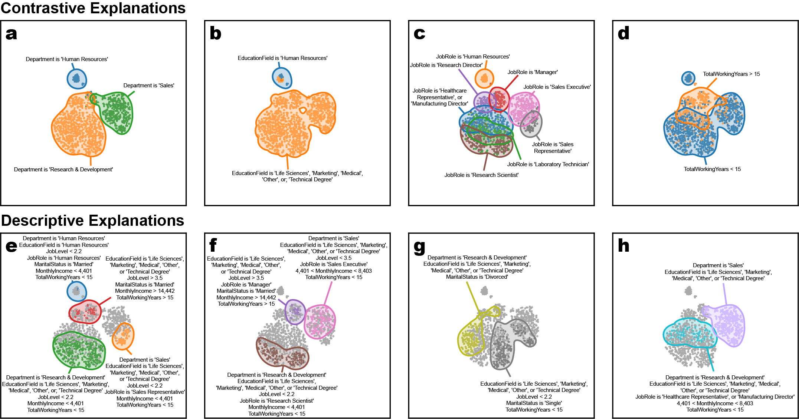

# Visual Explanations via Region Annotation (VERA)

[](https://opensource.org/licenses/BSD-3-Clause)

**VERA** is a Python library for generating **static visual explanations** of arbitrary two-dimensional point embeddings, usually produced by t-SNE, UMAP, or other dimensionality reduction techniques. The goal of VERA is to quickly and automatically generate explanations that give users a high-level overview of the embedding space without users having to load and interact with sometimes clunky interactive tools.


- [Documentation]() (TODO)
- [User Guide and Tutorial]() (TODO)
- [Preprint](https://arxiv.org/abs/2406.04808)



## Why VERA?

Two-dimensional embeddings are widely used in exploratory data analysis to visualize and understand complex data. While tools like scatter plots help users spot clusters or patterns, interpreting what these structures actually *mean* is still a largely manual process.

VERA automates this process. By identifying informative features and characteristic regions in the embedding, VERA produces multiple small, static visualizations that summarize the main structural patterns -- allowing users to quickly understand and communicate key insights.

VERA is particularly useful in workflows where:

- The original features are at least partially human-interpretable (e.g., tabular data).

- Users seek a quick overview of structure without manual exploration.

- There is a need to generate publication-ready summaries of embeddings.

## Limitations

- As a general purpose embedding explanation tool, VERA requires at least some human-interpretable features in order to generate embeddings (although embeddings can be generated from arbitrary feature sets). While VERA could be extended to text, image, and video data with domain-specific adaptations, this is currently not supported.

- Descriptive explanations generate annotations that include many features. If your data set contains a large number of features, the annotations may also become very long, rendering the visualization unusable. In this case, we suggest limiting explanations to a subset of features.

## Installation

`vera` can be easily installed through pip using

```
pip install vera-explain
```

[PyPI package](https://pypi.org/project/vera-explain/0.1.0/)

## A hello world example

Getting started with `vera` is very simple. First, we'll load up some data using scikit-learn.

```python
from sklearn import datasets

iris = datasets.load_iris()
x = iris["data"]
```

Next, we have to generate an embedding of the data. We'll use openTSNE here, but any embedding method will do.

```python
import openTSNE

embedding = openTSNE.TSNE().fit(x)
```

Then, we'll import and run the following commands to explain the embedding.

```python
import vera

region_annotations = vera.an.generate_region_annotations(x, embedding)
contrastive_explanations = vera.explain.contrastive(region_annotations)
descriptive_explanations = vera.explain.descriptive(region_annotations)

vera.pl.plot_annotations(contrastive_explanations)
vera.pl.plot_annotations(descriptive_explanations)
```

## Citation

If you make use of `vera` for your work we would appreciate it if you would cite the [paper](https://arxiv.org/abs/2406.04808):

```
\article{Policar2024
  title={VERA: Generating Visual Explanations of Two-Dimensional Embeddings via Region Annotation}, 
  author={Pavlin G. Poličar and Blaž Zupan},
  year={2024},
  eprint={2406.04808},
  archivePrefix={arXiv},
  primaryClass={cs.LG}
}
```
