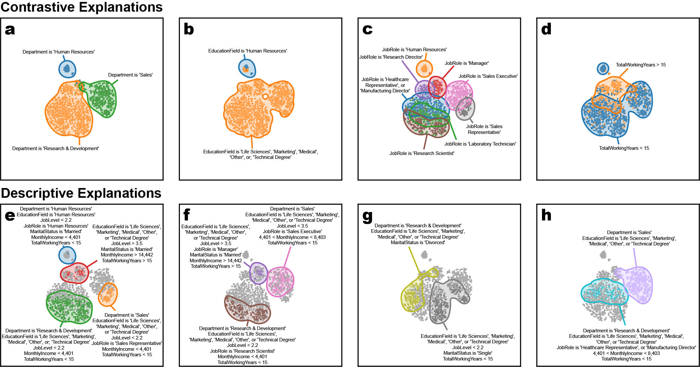

# Visual Explanations via Region Annotation (VERA)

[](https://opensource.org/licenses/BSD-3-Clause)

**VERA** is a Python library for generating **static visual explanations** of arbitrary two-dimensional point embeddings, usually produced by t-SNE, UMAP, or other dimensionality reduction techniques. The goal of VERA is to quickly and automatically generate explanations that give users a high-level overview of the embedding space without users having to load and interact with sometimes clunky interactive tools.


- [Documentation]() (TODO)
- [User Guide and Tutorial]() (TODO)
- [Preprint](https://arxiv.org/abs/2406.04808)



## Why VERA?

Two-dimensional embeddings are widely used in exploratory data analysis to visualize and understand complex data. While tools like scatter plots help users spot clusters or patterns, interpreting what these structures actually *mean* is still a largely manual process.

VERA automates this process. By identifying informative features and characteristic regions in the embedding, VERA produces multiple small, static visualizations that summarize the main structural patterns -- allowing users to quickly understand and communicate key insights.

VERA is particularly useful in workflows where:

- The original features are at least partially human-interpretable (e.g., tabular data).

- Users seek a quick overview of structure without manual exploration.

- There is a need to generate publication-ready summaries of embeddings.

## Limitations

- As a general purpose embedding explanation tool, VERA requires at least some human-interpretable features in order to generate embeddings (although embeddings can be generated from arbitrary feature sets). While VERA could be extended to text, image, and video data with domain-specific adaptations, this is currently not supported.

- Descriptive explanations generate annotations that include many features. If your data set contains a large number of features, the annotations may also become very long, rendering the visualization unusable. In this case, we suggest limiting explanations to a subset of features.

## Installation

`vera` can be easily installed through pip using

```
pip install vera-explain
```

[PyPI package](https://pypi.org/project/vera-explain/0.1.0/)

## A hello world example

Getting started with `vera` is very simple. First, we'll load up some data using scikit-learn.

```python
from sklearn import datasets

iris = datasets.load_iris()
x = iris["data"]
```

Next, we have to generate an embedding of the data. We'll use openTSNE here, but any embedding method will do.

```python
import openTSNE

embedding = openTSNE.TSNE().fit(x)
```

Then, we'll import and run the following commands to explain the embedding.

```python
import vera

region_annotations = vera.an.generate_region_annotations(x, embedding)
contrastive_explanations = vera.explain.contrastive(region_annotations)
descriptive_explanations = vera.explain.descriptive(region_annotations)

vera.pl.plot_annotations(contrastive_explanations)
vera.pl.plot_annotations(descriptive_explanations)
```

## Binary and presence features

Before regions are extracted, every column is expanded into indicator variables: continuous columns are discretized into bins, categorical columns are one-hot encoded. For a binary feature -- a gene that is either expressed or not, a flag that is either set or not -- this yields two indicators, and the negative one is annotated as a region of its own. A region labelled "gene is absent" is rarely something you want on a plot.

Name such columns in `indicator_columns` and they are used as they are, each described by its positive case alone. For a table of nothing but indicators -- a gene presence matrix, say -- pass `"all"`:

```python
presence = expression > 0

region_annotations = vera.an.generate_region_annotations(
    presence, embedding, indicator_columns="all"
)
```

In a mixed table, list the columns to be read this way; everything else is discretized or one-hot encoded as before:

```python
region_annotations = vera.an.generate_region_annotations(
    features, embedding, indicator_columns=["CD3", "CD4"]
)
```

Indicator columns have to be of boolean dtype. Nothing is converted on the way in: a 0/1 column is rejected rather than read as a flag -- cast it with `.astype(bool)` if that is what it means. A column with no positive samples is dropped.

Missing values are supported through pandas' nullable `boolean` dtype:

```python
presence = (expression > 0).astype("boolean")
presence[expression.isna()] = pd.NA
```

A sample with no measurement is not flagged, and it is not unflagged either. It takes no part in shaping the variable's region, it is never reported as a member, and it is left out of the rates the variable is scored on rather than counted against it. Where several variables are annotated together, a sample belongs to the group if every variable flags it, and is excluded as soon as one does not -- whether or not the others measured it.

The column name is what appears on the plot, so a `CD3` column is annotated `CD3`. To annotate a column with something else, pass a mapping instead of a list:

```python
region_annotations = vera.an.generate_region_annotations(
    features, embedding, indicator_columns={"CD3": "CD3 expressed"}
)
```

Each indicator forms a group of one, so `filter_uninformative` judges these variables on whether their region says anything: an indicator is dropped when its rule matches, or its region contains, at least `uninformative_max_sample_coverage` (default 0.95) of the data.

For an annotation that a label cannot express -- a threshold, a range, one of several categories -- build the variable yourself and use it as the column *name*. A column named by a `Variable` is passed through the expansion step unchanged, and its rule becomes the annotation:

```python
import pandas as pd
from vera.rules import IntervalRule
from vera.variables import ContinuousVariable, IndicatorVariable

base = ContinuousVariable("CD3", values=expression["CD3"].values)
rule = IntervalRule(lower=2.5, value_name="CD3")
above_threshold = IndicatorVariable(base, rule, (base.values > 2.5).astype(float))

features = pd.DataFrame({above_threshold: above_threshold.values})
region_annotations = vera.an.generate_region_annotations(features, embedding)
```

## Citation

If you make use of `vera` for your work we would appreciate it if you would cite the [paper](https://arxiv.org/abs/2406.04808):

```
\article{Policar2024
  title={VERA: Generating Visual Explanations of Two-Dimensional Embeddings via Region Annotation}, 
  author={Pavlin G. Poličar and Blaž Zupan},
  year={2024},
  eprint={2406.04808},
  archivePrefix={arXiv},
  primaryClass={cs.LG}
}
```
